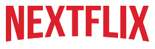

# 🎬 Nextflix - Netflix Clone

Modern ve responsive Netflix clone web uygulaması. Bu proje, Netflix'in landing page tasarımını modern web teknolojileri kullanarak yeniden oluşturur.



## 🎨 Tasarım

Bu proje [Netflix Design System 2024 - Website version](https://www.figma.com/design/JzpcrSZDQFT4mHyYPW4UCs/Netflix-Design-System-2024--Website-ver.--%F0%9F%8E%A5--Community-?node-id=39-162&t=cukLrVE9AmjakPpU-1) Figma tasarımı baz alınarak geliştirilmiştir.

## 🚀 Teknolojiler

Bu projede kullanılan ana teknolojiler:

### Frontend Framework
- **Next.js 15.5.4** - React tabanlı full-stack framework
- **React 19.1.0** - UI kütüphanesi
- **TypeScript 5** - Type-safe JavaScript

### Styling & UI
- **Tailwind CSS 4** - Utility-first CSS framework
- **Shadcn UI** - Accessible UI component library
  - Accordion
  - Dialog
  - Popover
- **Lucide React** - Beautiful & consistent icon library


- **Class Variance Authority (CVA)** - Component variant utility

### Geliştirme Araçları
- **Turbopack** - Hızlı bundler (Next.js 15 ile)
- **PostCSS** - CSS processing
- **clsx & tailwind-merge** - Conditional styling utilities

## 📦 Kurulum

Projeyi yerel makinenizde çalıştırmak için:

```bash
# Repository'yi klonlayın
git clone <repository-url>
cd nextflix

# Bağımlılıkları yükleyin
npm install

# Geliştirme sunucusunu başlatın
npm run dev
```

Tarayıcınızda [http://localhost:3000](http://localhost:3000) adresine giderek uygulamayı görüntüleyebilirsiniz.

## 🏗️ Proje Yapısı

```
nextflix/
├── public/                 # Statik dosyalar (resimler, ikonlar)
│   ├── enjoytv.png
│   ├── herobg.png
│   ├── kids.png
│   ├── logo.png
│   ├── offline.png
│   ├── popcorn.png
│   └── watcheverywhere.png
├── src/
│   ├── app/               # Next.js App Router
│   │   ├── globals.css    # Global stiller
│   │   ├── layout.tsx     # Ana layout
│   │   └── page.tsx       # Ana sayfa
│   ├── components/        # React bileşenleri
│   │   ├── ui/           # Yeniden kullanılabilir UI bileşenleri
│   │   ├── enjoyonyourtv.tsx
│   │   ├── faq.tsx
│   │   ├── footer.tsx
│   │   ├── hero.tsx
│   │   ├── kids.tsx
│   │   ├── languageSelector.tsx
│   │   ├── navbar.tsx
│   │   ├── offline.tsx
│   │   └── watchEverywhere.tsx
│   └── lib/
│       └── utils.ts       # Yardımcı fonksiyonlar
└── ...
```

## 🎯 Özellikler

- **Responsive Tasarım** - Mobil, tablet ve desktop uyumlu
- **Modern UI Bileşenleri** - Shadcn UI ile accessible bileşenler
- **FAQ Accordion** - Genişletilebilir soru-cevap bölümü

- **Optimized Performance** - Next.js 15 ve Turbopack ile hızlı yükleme
- **Type Safety** - TypeScript ile güvenli kodlama

## 🎬 Bileşenler

- **Hero Section** - Ana banner ve CTA
- **Enjoy on Your TV** - TV deneyimi bölümü
- **Watch Everywhere** - Multi-platform erişim
- **Kids Profile** - Çocuk profili özelliği
- **Download & Watch Offline** - Offline izleme
- **FAQ** - Sıkça sorulan sorular
- **Footer** - Alt bilgi ve linkler

## 📱 Responsive Breakpoints

- **Mobile**: < 768px
- **Tablet**: 768px - 1024px
- **Desktop**: > 1024px

## 🛠️ Scripts

```bash
# Geliştirme modunda çalıştır
npm run dev

# Production build oluştur
npm run build

# Production sunucusunu başlat
npm start
```

## 👨‍💻 Geliştirici

**Hüseyin Kocatürk**

- Bu proje, modern web geliştirme teknolojilerini kullanarak Netflix'in kullanıcı deneyimini yeniden oluşturmayı amaçlamaktadır.
- Responsive tasarım prensiplerine uygun olarak geliştirilmiştir.
- Accessibility standartlarına uygun UI bileşenleri kullanılmıştır.

## 📄 Lisans

Bu proje eğitim amaçlı geliştirilmiştir.

---

⭐ Projeyi beğendiyseniz yıldız vermeyi unutmayın!
