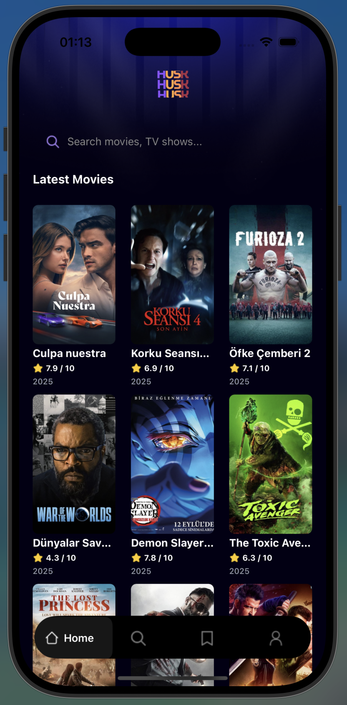
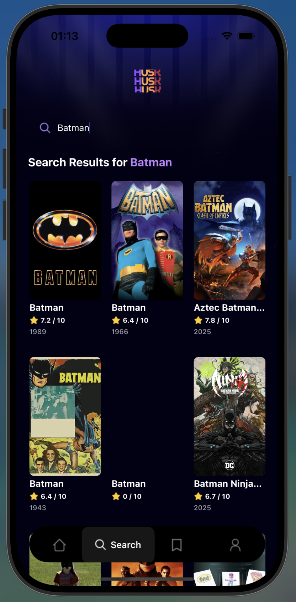

# 🎬 MovieApp - React Native Film Uygulaması

Bu proje, **ilk React Native deneyimim** olarak geliştirilmiş, **TMDB (The Movie Database) API**'sini kullanan modern bir film keşif uygulamasıdır.

## 📱 Proje Hakkında

MovieApp, kullanıcıların popüler filmleri keşfetmelerini, arama yapmalarını ve favori filmlerini kaydedebilmelerini sağlayan bir mobil uygulamadır. Bu proje, React Native ve Expo teknolojilerini öğrenme sürecimde geliştirdiğim ilk kapsamlı mobil uygulama.

### 🎯 Özellikler

- **Film Keşfi**: TMDB API'den çekilen popüler filmlerin listelenmesi
- **Arama Fonksiyonu**: Film adına göre arama yapabilme
- **Film Detayları**: Seçilen filmin detaylı bilgilerine erişim
- **Kayıtlı Filmler**: Beğenilen filmleri kaydetme (Appwrite backend)
- **Profil Yönetimi**: Kullanıcı profil sayfası
- **Responsive Tasarım**: Farklı ekran boyutlarına uyumlu arayüz

## 🚀 Teknolojiler ve Yaklaşımlar

### Ana Teknolojiler
- **React Native** (0.81.4) - Çapraz platform mobil uygulama geliştirme
- **Expo** (~54.0.12) - Geliştirme ve dağıtım platformu
- **TypeScript** - Tip güvenli kod geliştirme
- **Expo Router** - Dosya tabanlı navigasyon sistemi
- **NativeWind** - Tailwind CSS ile native styling

### Backend ve API
- **TMDB API** - Film verileri için
- **Appwrite** - Backend-as-a-Service (kullanıcı ve kayıt yönetimi)

### Kullanılan Kütüphaneler
- `@react-navigation/bottom-tabs` - Alt tab navigasyonu
- `expo-image` - Optimize edilmiş görsel yükleme
- `react-native-reanimated` - Smooth animasyonlar
- `react-native-gesture-handler` - Dokunma jestleri

## 🎓 İlk React Native Deneyimim - Öğrendiklerim

Bu projeyi geliştirirken edindiğim deneyimler:

### 1. **React Native Ekosistemi**
- React Native'in web geliştirmeden farklı yaklaşımları (`View`, `Text`, `FlatList` gibi native bileşenler)
- Expo'nun sağladığı hızlı geliştirme avantajları
- Native modüller ve API'lerin mobil ortamda nasıl çalıştığı

### 2. **Dosya Tabanlı Routing (Expo Router)**
- `app/(tabs)` klasör yapısıyla tab navigasyonu oluşturma
- `[id].tsx` ile dinamik route parametreleri kullanma
- `_layout.tsx` dosyalarıyla layout yönetimi

### 3. **API Entegrasyonu**
- TMDB API ile REST API çağrıları yapma
- Environment variables ile API key yönetimi (`process.env.EXPO_PUBLIC_MOVIE_API_KEY`)
- Custom hooks (`useFetch`) ile veri yönetimi
- Loading ve error state'lerini handle etme

### 4. **Styling Yaklaşımı**
- NativeWind ile Tailwind CSS benzeri syntax kullanımı
- `className` prop'u ile native komponent stilleme
- Responsive tasarım prensipleri
- Custom font ve asset yönetimi

### 5. **Component Mimarisi**
- Reusable componentler oluşturma (`MovieCard`, `SearchBar`)
- Props ve interfaces ile tip güvenliği
- FlatList ile performanslı liste rendering

### 6. **Karşılaştığım Zorluklar ve Çözümler**
- **Web vs Native farkları**: `div` yerine `View`, `img` yerine `Image` kullanımına alışma
- **Navigation**: Expo Router'ın dosya tabanlı sistemini anlama ve uygulamaya adapte etme
- **Styling**: CSS'den farklı olarak style object'leri ve NativeWind'in sınırlamalarını öğrenme
- **API Yönetimi**: Asenkron veri çekme ve state yönetimini mobil ortamda uygulama

## 📦 Kurulum

1. Bağımlılıkları yükleyin:
   ```bash
   npm install
   ```

2. `.env` dosyası oluşturun ve TMDB API anahtarınızı ekleyin:
   ```
   EXPO_PUBLIC_MOVIE_API_KEY=your_tmdb_api_key_here
   ```

3. Uygulamayı başlatın:
   ```bash
   npx expo start
   ```

4. Aşağıdaki seçeneklerle uygulamayı açabilirsiniz:
   - [Expo Go](https://expo.dev/go) - Hızlı test için
   - [iOS Simulator](https://docs.expo.dev/workflow/ios-simulator/)
   - [Android Emulator](https://docs.expo.dev/workflow/android-studio-emulator/)

### TMDB API Anahtarı Alma
1. [TMDB](https://www.themoviedb.org/) sitesine kaydolun
2. Ayarlar > API bölümüne gidin
3. API anahtarınızı alın ve `.env` dosyasına ekleyin

## 📂 Proje Yapısı

```
MovieApp/
├── app/                    # Ana uygulama dosyaları
│   ├── (tabs)/            # Tab navigasyon sayfaları
│   │   ├── index.tsx      # Ana sayfa (Film listesi)
│   │   ├── search.tsx     # Arama sayfası
│   │   ├── saved.tsx      # Kaydedilen filmler
│   │   └── profile.tsx    # Profil sayfası
│   └── movies/
│       └── [id].tsx       # Film detay sayfası
├── components/            # Reusable componentler
│   ├── MovieCard.tsx      # Film kartı komponenti
│   └── SearchBar.tsx      # Arama bar komponenti
├── services/              # API servisleri
│   ├── api.ts            # TMDB API fonksiyonları
│   ├── appwrite.ts       # Appwrite backend
│   └── useFetch.ts       # Custom data fetching hook
├── constants/            # Sabit değerler (iconlar, görseller)
├── interfaces/           # TypeScript interface tanımları
└── assets/              # Statik dosyalar
```

## 🎨 Ekran Görüntüleri

<div align="center">
  
  
</div>

## 🔜 Gelecek Geliştirmeler

- [ ] Film favorilere ekleme/çıkarma animasyonları
- [ ] Film fragman izleme özelliği
- [ ] Kategori bazlı filtreleme
- [ ] Kullanıcı yorumları
- [ ] Sosyal paylaşım özellikleri
- [ ] Dark/Light mode toggle

## 📚 Kaynaklar

- [Expo Documentation](https://docs.expo.dev/)
- [React Native Documentation](https://reactnative.dev/)
- [TMDB API Documentation](https://developer.themoviedb.org/docs)
- [NativeWind](https://www.nativewind.dev/)
- [Appwrite Documentation](https://appwrite.io/docs)

## 📝 Notlar

Bu proje, React Native öğrenme sürecimin bir parçası olarak geliştirilmiştir. Kod tabanı sürekli geliştirilmekte ve optimize edilmektedir. Önerileriniz ve geri bildirimleriniz için issue açabilir veya pull request gönderebilirsiniz.

## 👨‍💻 Geliştirici

İlk React Native projem olması nedeniyle, öğrenme sürecim ve karşılaştığım zorluklar hakkında daha fazla bilgi almak isterseniz benimle iletişime geçebilirsiniz.

---

**Not**: Bu proje eğitim ve portföy amaçlı geliştirilmiştir.
